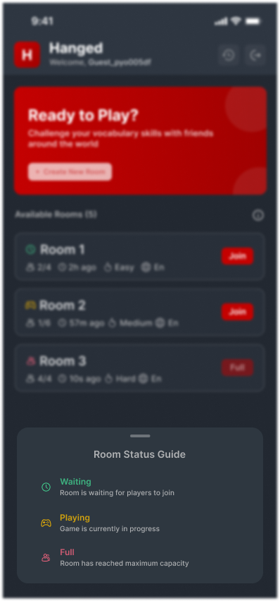
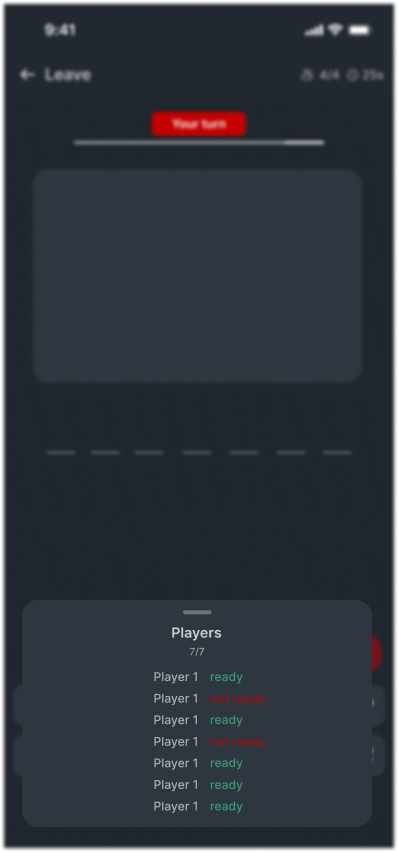

# 🪓 Hanged – Multiplayer Hangman Game

### 🎮 Overview

**Hanged** is a real-time multiplayer Hangman game built with **Jetpack Compose**, **Clean
Architecture**, and **Firebase**.  
Players can create or join rooms, play together in real-time via **WebSocket (Socket.IO)**, and
track their game history and leaderboard position.

---

### 🧩 App Thumbnail

---

## 📱 App Screenshots

| Splash | Login | Register |
|--------|--------|----------|
|  |  |  |

| Home                                                 | Game (not started)                                   | Game (started)                                        |
|------------------------------------------------------|------------------------------------------------------|-------------------------------------------------------|
|  |  |  |

| Room Status Guide                                          | Players                                          | Game History                                          |
|------------------------------------------------------------|--------------------------------------------------|-------------------------------------------------------|
|  |  |  |

| Leaderboard                                          |
|------------------------------------------------------|
|  |

---

## ⚙️ Tech Stack

| Category                 | Technologies                              |
|--------------------------|-------------------------------------------|
| **Language**             | Kotlin                                    |
| **Architecture**         | Clean Architecture + MVI                  |
| **UI**                   | Jetpack Compose, Material Design 3        |
| **Backend**              | Firebase (Auth, Firestore, Storage)       |
| **Realtime**             | WebSocket (Socket.IO)                     |
| **Dependency Injection** | Hilt                                      |
| **Local Storage**        | DataStore                                 |
| **Networking**           | Retrofit                                  |
| **Coroutines / Flow**    | For async operations and state management |
| **Animations**           | Lottie Animations                         |

---

## 🚀 Features

- 👥 **Multiplayer gameplay** via WebSocket
- 🔐 **Firebase Authentication** (Email/Password)
- 💬 **Real-time communication** between players
- 🏆 **Leaderboard and history tracking**
- ⚡ **Clean Architecture + MVI** ensures scalability and maintainability

